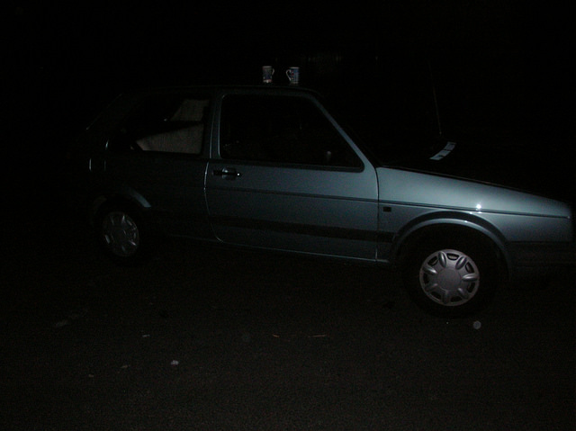
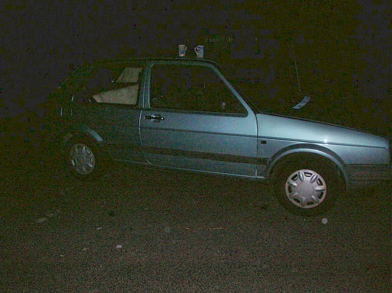
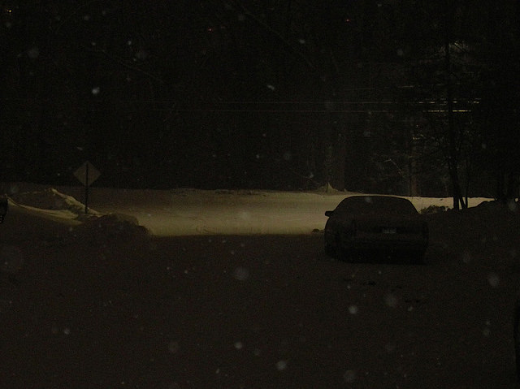
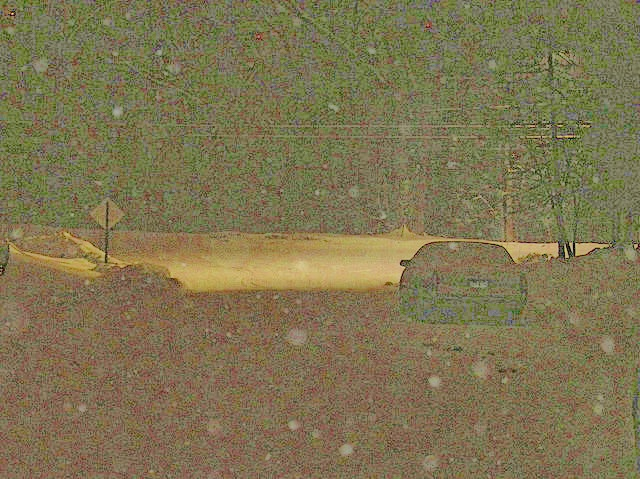

# CLAHE-Based-Low-Light-Image-Enhancement

Python implementation of the algorithm depicted in the paper (based on individual interpretation) "An Improved Method for Reconstruction and Enhancing Dark Images Based on CLAHE" by Pavan A.C., Lakshmi S. and M. T. Somashekara. Note that the image fusion algorithm is taken from this paper "Adaptive Image Enhancement Method for Correcting Low-Illumination Images" by Wang et al.

The input to the functions are the numpy array of the RGB image (in RGB color space) to be enhanced, and the opencv-python CLAHE object (parameters to be determined based on application), while the output of the function is the numpy array of the enhanced RGB image (in RGB color space).

Google Scholar Citation:

Pavan, A. C., Lakshmi, S., & MT, S. (2023). An Improved Method for Reconstruction and Enhancing Dark Images based on CLAHE. International Research Journal on Advanced Science Hub, 5(02).

Wang, W., Chen, Z., Yuan, X., & Wu, X. (2019). Adaptive image enhancement method for correcting low-illumination images. Information Sciences, 496, 25-41.

Paper link:

https://rspsciencehub.com/article_23348_b91baaa223ab8ea32e47aa668fed6eb1.pdf

The algorithm is tested on the Exclusively Dark (ExDark) dataset, which can be downloaded here:

https://github.com/cs-chan/Exclusively-Dark-Image-Dataset

The algorithm is also tested on a video (click on the image to watch the video):

