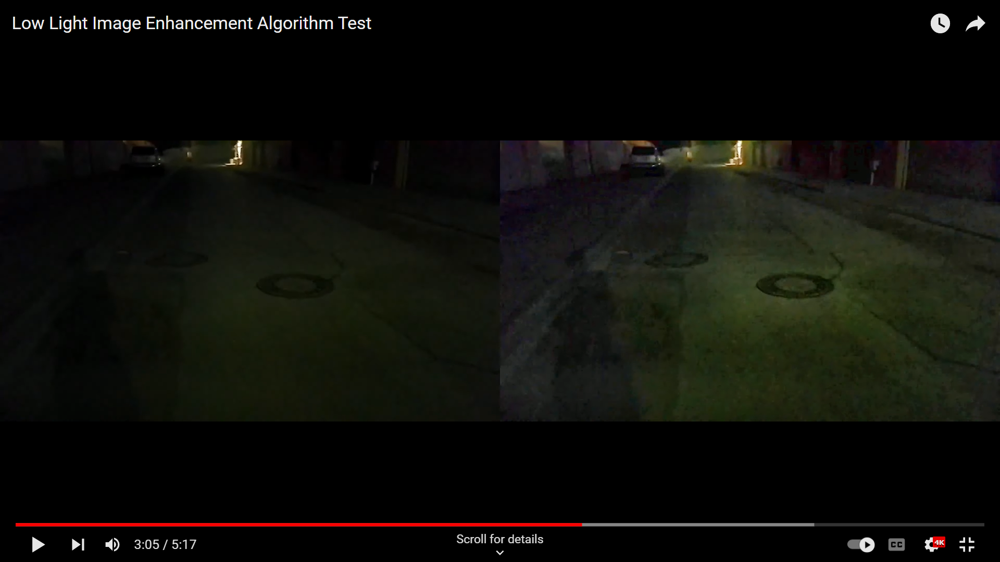

# CLAHE-Low-Light-Image-Enhancement

Python implementation of the algorithm depicted in the paper (based on individual interpretation) "An Improved Method for Reconstruction and Enhancing Dark Images Based on CLAHE" by Pavan A.C., Lakshmi S. and M. T. Somashekara.

Google Scholar Citation:
Pavan, A. C., Lakshmi, S., & MT, S. (2023). An Improved Method for Reconstruction and Enhancing Dark Images based on CLAHE. International Research Journal on Advanced Science Hub, 5(02).

Paper link:
https://rspsciencehub.com/article_23348_b91baaa223ab8ea32e47aa668fed6eb1.pdf

The algorithm is tested on the Exclusively Dark (ExDark) dataset, which can be downloaded here:
https://github.com/cs-chan/Exclusively-Dark-Image-Dataset

The algorithm is also tested on a video:

